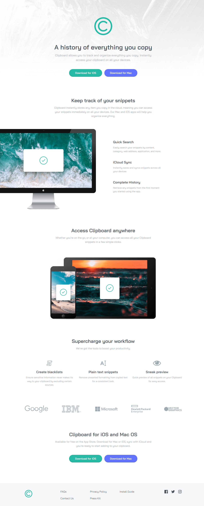

# Frontend Mentor - Clipboard landing page solution

This is a solution to the [Clipboard landing page challenge on Frontend Mentor](https://www.frontendmentor.io/challenges/clipboard-landing-page-5cc9bccd6c4c91111378ecb9). Frontend Mentor challenges help you improve your coding skills by building realistic projects. 

## Table of contents

- [Overview](#overview)
  - [The challenge](#the-challenge)
  - [Screenshot](#screenshot)
  - [Links](#links)
- [My process](#my-process)
  - [Built with](#built-with)
  - [What I learned](#what-i-learned)
- [Author](#author)

## Overview
- A responsive landing page built with HTML and CSS

### The challenge
- Build out this landing page and get it looking as close to the design as possible

### Screenshot

### Links
- Live Site URL: https://jazzy-faun-001c49.netlify.app

## My process
- Utilized various **CSS Grid** properties to define the page layout
- Used different **container** utility classes to set the max-width of the different sections, allowing for full-width backgrounds
- Used a mobile-first approach to writing CSS
- Used various **flexbox** properties to define the layout and positioning of content within different sections
- Adjusted **flexbox** and **CSS Grid** properties within media queries to adapt the website to larger device sizes
 

### Built with
- Semantic HTML5 markup
- CSS custom properties
- CSS Flexbox
- CSS Grid
- Mobile-first approach to CSS

### What I learned
- How to approach a larger project with unique sections on a single page
- Practiced writing HTML that logically separates the different sections on the page
- Utilized utility classes (*container*) to share behavior between different sections
- Continued practice with writing mobile-first CSS
- Adjusting *flexbox* and *CSS Grid* properties for larger device sizes to match the provided design spec

## Author
- Ryan Hemrick